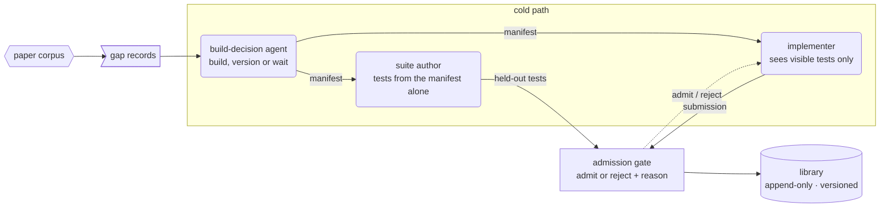

# Diagrams and charts

| Task | CLI | MCP tool |
|---|---|---|
| render a spec or Mermaid file to SVG (and PNG) | `tundlekit diagram render SPEC.json -o OUT.svg [--png OUT.png]` | `diagram_render` |
| check a spec without rendering | `tundlekit diagram validate SPEC.json` | `diagram_validate` |
| Mermaid → spec | `tundlekit diagram from-mermaid FLOW.mmd` | `diagram_from_mermaid` |
| spec → Mermaid | `tundlekit diagram to-mermaid SPEC.json` | `diagram_to_mermaid` |
| bar chart to SVG | `tundlekit chart bar CHART.json -o OUT.svg` | `chart_bar` |
| the colours and the rules | `tundlekit palette show` | `palette_get` |

`diagram render` also takes a Mermaid file directly (MCP: `mermaid_path` or inline `mermaid`). All of it is
standard library only. PNG output needs `cairosvg`, `rsvg-convert` or `inkscape`; check with
`tundlekit render backends` (`svg_to_png`). Add `--json` for machine-readable results.

## The rules

| Rule | How |
|---|---|
| Colour = stage | `stage` picks the hue (below). Hues are Okabe-Ito based, so they stay distinct for colour-blind readers |
| Style = actor | `model`: tinted fill + MODEL tag · `code` (deterministic): white fill, stage border + CODE tag · `record`: folded corner · `external`: grey |
| 1 box per model call or session | never 1 box hiding several model uses. Split "Build" into build-decision agent (MODEL) → suite author (MODEL) → implementer (MODEL) → admission gate (CODE) |
| Legend whenever more than 1 actor is shown | `"legend": "auto"` does this and adds "1 box = 1 model session" when a model box is present |
| Nothing depends on colour alone | every box has a text label; outcome colours only mark node states |
| Properties in labels | "library\nappend-only · versioned", "FIXED AT THE FREEZE", "PROTECTED", not only in the prose |
| Illustrative content is marked | `"note": "(illustrative)"`, "Example servers are illustrative" |
| Big text | labels readable at slide width; if a figure is too small on the slide, split it or cut labels |
| Draw mechanisms people misread | e.g. a task DAG over ticks: dependencies, a failure skipping its children, a write-scope conflict waiting |

Stages (`tundlekit palette show` prints the hex values): `intent` #0072B2 (compiled intent, requirements),
`binding` #2A8FA8 (plan and binding), `freeze` #7B3FA0 (frozen or protected things), `dispatch` #D98200
(execution; the default), `gates` #008A63 (gates, evaluation), `claims` #B8527F (claims, delivery), `build` #3D4FB0
(deciding and building), `library` #8C5A2B (library, versions, lifecycle), `external` #6b6b6b (outside the system:
papers, servers, peers). Outcome colours (node states only): passed #008A63, failed #D55E00, skipped #bdbdbd,
running #D98200, ready #0072B2, pending #ffffff. Model fills are the stage colour tinted to 20%.

Count the model sessions in the prose that describes a figure, then count the MODEL boxes. They must match.

## Reproduce a paper's figure or draw your own?

- **Reproduce the paper's figure** when explaining someone else's system, above all an unfamiliar one (a
  self-improving agent explained without its Fig. 1 makes no sense to the audience). Crop it from the rendered
  PDF page (`tundlekit render pdf PAPER.pdf -o pages --first 3 --last 3`), and caption it
  "reproduced from [n, Fig. 1]". Use it as a deck `figure` body.
- **Draw your own** for your own design, for mechanisms a paper only describes in text, and for combining
  several papers' ideas in 1 picture. Never redraw a paper's figure with changes and present it as theirs.
- Prefer 1 diagram the presenter can talk over to a table plus a diagram.

## Spec

```json
{
  "title": "Build path for a new tool",
  "direction": "LR",
  "nodes": [
    {"id": "gaps", "label": "gap records", "sub": "cost and count per gap", "stage": "build", "actor": "record"},
    {"id": "decide", "label": "build-decision agent", "sub": "build, version or wait", "stage": "build", "actor": "model"},
    {"id": "author", "label": "suite author", "sub": "tests from the manifest alone", "stage": "gates", "actor": "model"},
    {"id": "impl", "label": "implementer", "sub": "sees visible tests only", "stage": "build", "actor": "model"},
    {"id": "gate", "label": "admission gate\nFIXED AT THE FREEZE", "stage": "gates", "actor": "code"},
    {"id": "lib", "label": "library\nappend-only · versioned", "stage": "library", "actor": "record"}
  ],
  "edges": [
    {"from": "gaps", "to": "decide"},
    {"from": "decide", "to": "author", "label": "manifest"},
    {"from": "decide", "to": "impl", "label": "manifest"},
    {"from": "author", "to": "gate", "label": "held-out tests"},
    {"from": "impl", "to": "gate", "label": "submission"},
    {"from": "gate", "to": "impl", "label": "admit / reject", "dashed": true},
    {"from": "gate", "to": "lib", "label": "admitted"}
  ],
  "groups": [{"id": "cold", "label": "cold path", "nodes": ["decide", "author", "impl"], "stage": "build"}],
  "legend": "auto",
  "tags": true,
  "note": "(illustrative)"
}
```

- `id`: letters, digits, `_`, `-`, starting with a letter or `_`; unique across nodes and groups.
- `label`: non-empty; `\n` breaks lines. `sub`: an optional smaller second line.
- `stage` (default `dispatch`), `actor` ∈ `model | code | record | external` (default `code`), `dashed` (bool).
- `direction`: `LR` (default) or `TB`. `legend`: `"auto"` (default), `true`, `false`. `tags`: show MODEL/CODE tags
  (default true). `note`: small text at the bottom.
- `edges`: `from`, `to` (existing ids, no self-loops), optional `label`, `dashed`. Back edges (loops) are allowed
  and drawn, but ignored for ranking.
- `groups`: `id`, `label`, `nodes` (each node in at most 1 group), optional `stage`; drawn as a dashed frame.
- Validation reports every problem with its path (`nodes[2].stage: ...`). Run `diagram validate` first.

Layout is automatic and deterministic: rank = longest path from a source, boxes widen to fit their longest line,
nothing overlaps. The result gives each node's box (`x`, `y`, `w`, `h`, `rank`) and any `warnings`.
The same spec gives byte-identical SVG, so commit the spec and regenerate the figure.

## Mermaid subset



| Mermaid | Meaning |
|---|---|
| `flowchart LR` / `graph TD` | first line; `LR`, `RL` → LR; `TB`, `TD`, `BT` → TB; no direction → TB |
| `id[label]` | code box |
| `id(label)` | model box |
| `id>label]` or `id[(label)]` | record |
| `id{{label}}` | external |
| `"..."` around a label, `<br>` inside it | quotes removed; `<br>` becomes a line break |
| `:::stage` after a node | sets the stage (an unknown name gives a warning and the default stage) |
| `-->`, `---`, `==>` | solid edge |
| `-.->`, `-.-` | dashed edge |
| `-->\|text\|`, `-.->\|text\|`, `-- text -->` | edge label |
| `A --> B --> C`, `A & B --> C` | chains and fan-in give 1 edge per pair |
| `subgraph id [label]` … `end` | a group of the nodes first defined or referenced inside it |
| `classDef`, `class`, `style`, `linkStyle`, `click` | ignored with a warning |

Anything else is an error naming the line number. Node ids are ASCII only. Workflow:

```
tundlekit diagram validate flow.mmd
tundlekit diagram render flow.mmd -o fig-build.svg --png fig-build.png
tundlekit diagram from-mermaid flow.mmd --json
tundlekit diagram to-mermaid fig-build.json
```

`from-mermaid` returns `{"spec": ..., "warnings": [...]}`; save the `spec` value as `fig-build.json` to keep
editing the figure as a spec.

Converting spec → Mermaid → spec keeps nodes, edges, groups and direction; `sub` is folded into the label as a
second line.

## Bar charts

Use a chart when a result is a comparison of a few numbers. Grey bars, 1 highlighted bar in a stage colour,
data labels on, n in the category labels, and a bold takeaway line that states the point.

```json
{
  "title": "Kept tools that fail held-out tests of their own capability",
  "categories": ["One-Shot", "ToolMaker-style", "CREATOR-style", "All tools"],
  "values": [100.0, 100.0, 91.7, 96.8],
  "n": [119, 19, 84, 222],
  "highlight": "All tools",
  "unit": "%",
  "max": 100,
  "decimals": 1,
  "stage": "gates",
  "orientation": "horizontal",
  "takeaway": "Tools that run cleanly still return wrong answers on unseen inputs"
}
```

```
tundlekit chart bar chart.json -o fig-rot.svg
```

- `categories` and `values` have the same length (and `n`, if given); values are ≥ 0.
- `highlight`: an index or a category name. `max` fixes the axis (≥ every value). `decimals` defaults to 0 for
  whole numbers, else 1. `orientation`: `horizontal` (default) or `vertical`.
- In a deck, prefer a native chart (`"kind": "chart"` in the deck spec, see the deck-builder skill) so it stays
  editable; use `chart bar` for reports and notes.

## Checklist

- [ ] 1 box per model call; MODEL box count matches the prose
- [ ] every box has a stage and an actor; a legend when more than 1 actor
- [ ] key properties in the labels; illustrative content marked
- [ ] every term in the figure is defined in the text before the figure appears
- [ ] rendered and looked at at the size it will be shown (slide and report); labels readable
- [ ] paper figures are reproduced with a "reproduced from" caption, own designs drawn with this tool
